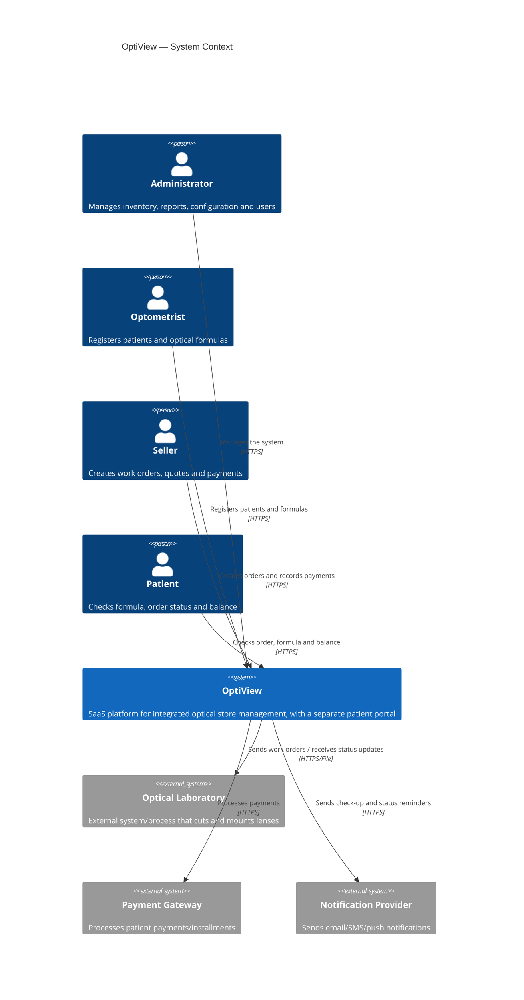
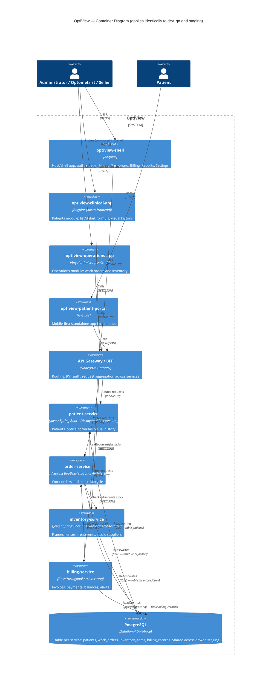
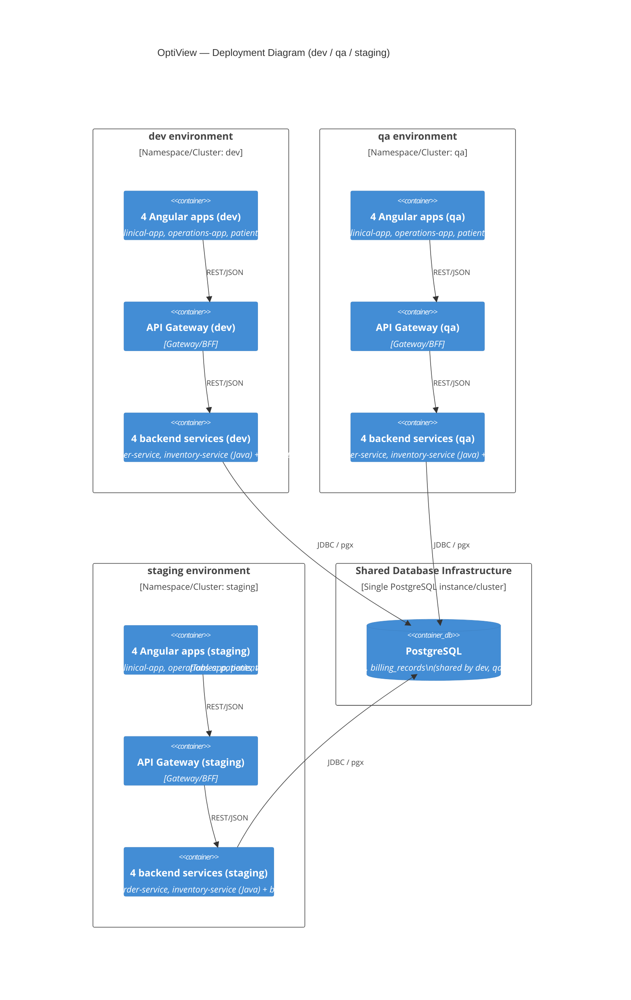

# OptiView — C4 Architecture Model

This document describes the OptiView architecture using the [C4 model](https://c4model.com/) (Context, Containers, Components, Code/Deployment). Diagrams are expressed in Mermaid so they render directly in any Markdown viewer that supports it (GitHub, GitLab, VS Code, etc.).

Related document: `OptiView-PRD-EN.md` (functional and architectural requirements).

---

## Level 1 — System Context Diagram

Shows OptiView as a single system and its interactions with users and external systems.

---

## Level 2 — Container Diagram

Shows the major deployable units: 4 Angular frontends, an API Gateway/BFF, 4 backend services (3 Java + 1 Go), and the shared PostgreSQL database.

**Notes:**
- `optiview-shell`, `optiview-clinical-app` and `optiview-operations-app` are composed as micro-frontends into a single authenticated experience (e.g. via Module Federation), matching the sidebar navigation described in the PRD (section 5.1).
- `optiview-patient-portal` is deployed and versioned independently, mobile-first, with no sidebar (PRD section 5.2).
- Cross-service calls (`order-service → inventory-service`, `order-service → patient-service`, `billing-service → order-service`) happen over REST, never via direct database access — each service owns its table exclusively.

---

## Level 3 — Component Diagram (example: `order-service`)

Zooms into `order-service` to show its internal **Hexagonal Architecture**. The same pattern (domain core, inbound/outbound ports, inbound/outbound adapters) applies to `patient-service` and `inventory-service` (Java) and, idiomatically, to `billing-service` (Go).

```mermaid
C4Component
 title order-service — Component Diagram (Hexagonal Architecture)

 Container_Boundary(orderSvc, "order-service (Java / Spring Boot)") {

 Component(restController, "WorkOrderRestController", "Inbound Adapter (REST)", "Exposes /api/v1/work-orders endpoints")

 Component(createUseCase, "CreateWorkOrderUseCase", "Inbound Port / Application Service", "Orchestrates creation of a new work order")
 Component(advanceUseCase, "AdvanceWorkOrderStatusUseCase", "Inbound Port / Application Service", "Advances the order to its next lifecycle status")
 Component(queryUseCase, "QueryWorkOrdersUseCase", "Inbound Port / Application Service", "Lists and retrieves work orders")

 Component(domain, "WorkOrder Domain Model", "Domain Core", "WorkOrder, OrderLineItem, OrderStatus entities/value objects and business rules")

 Component(repoPort, "WorkOrderRepositoryPort", "Outbound Port", "Interface for persisting/retrieving work orders")
 Component(inventoryPort, "InventoryClientPort", "Outbound Port", "Interface for checking/discounting stock")
 Component(patientPort, "PatientClientPort", "Outbound Port", "Interface for reading a patient's current formula")
 Component(notificationPort, "NotificationPort", "Outbound Port", "Interface for notifying the patient on status change")

 Component(repoAdapter, "PostgresWorkOrderRepository", "Outbound Adapter", "Implements WorkOrderRepositoryPort against table work_orders")
 Component(inventoryAdapter, "InventoryServiceHttpClient", "Outbound Adapter", "Implements InventoryClientPort via REST calls to inventory-service")
 Component(patientAdapter, "PatientServiceHttpClient", "Outbound Adapter", "Implements PatientClientPort via REST calls to patient-service")
 Component(notificationAdapter, "NotificationHttpClient", "Outbound Adapter", "Implements NotificationPort via the notification provider")
 }

 ContainerDb(db, "PostgreSQL", "table: work_orders")
 Container(inventorySvc, "inventory-service", "Java / Spring Boot")
 Container(patientSvc, "patient-service", "Java / Spring Boot")
 System_Ext(notification, "Notification Provider")

 Rel(restController, createUseCase, "Invokes")
 Rel(restController, advanceUseCase, "Invokes")
 Rel(restController, queryUseCase, "Invokes")

 Rel(createUseCase, domain, "Uses")
 Rel(advanceUseCase, domain, "Uses")
 Rel(queryUseCase, domain, "Uses")

 Rel(createUseCase, repoPort, "Uses")
 Rel(createUseCase, inventoryPort, "Uses")
 Rel(createUseCase, patientPort, "Uses")
 Rel(advanceUseCase, repoPort, "Uses")
 Rel(advanceUseCase, notificationPort, "Uses")
 Rel(queryUseCase, repoPort, "Uses")

 Rel(repoAdapter, repoPort, "Implements")
 Rel(inventoryAdapter, inventoryPort, "Implements")
 Rel(patientAdapter, patientPort, "Implements")
 Rel(notificationAdapter, notificationPort, "Implements")

 Rel(repoAdapter, db, "Reads/writes", "JDBC")
 Rel(inventoryAdapter, inventorySvc, "Calls", "REST/JSON")
 Rel(patientAdapter, patientSvc, "Calls", "REST/JSON")
 Rel(notificationAdapter, notification, "Calls", "HTTPS")
```

**Reading the hexagon:**
-**Domain core** (`WorkOrder Domain Model`) has zero dependencies on Spring, HTTP or JDBC — pure business logic.
-**Inbound side** (left): REST controller → use cases (inbound ports) → domain.
-**Outbound side** (right): use cases depend on **outbound port interfaces** (`WorkOrderRepositoryPort`, `InventoryClientPort`, etc.), never on concrete adapters. The concrete Postgres/REST adapters are injected at runtime (dependency inversion).
- This is why the database technology, the inventory-service transport, or the notification provider can all change without touching `CreateWorkOrderUseCase` or the domain model.

---

## Level 4 — Deployment Diagram (Environments)

Shows how the 4 backend services + 4 frontends are replicated across the three environments, and how all of them share the single PostgreSQL database.

**Key deployment facts:**
- Each environment (`dev`, `qa`, `staging`) has its **own independent deployment** of the 4 backend services and the 4 Angular frontends — independent versions, independent configuration, independent logs.
- All three environments point to the **same PostgreSQL database and the same 4 tables** (`patients`, `work_orders`, `inventory_items`, `billing_records`). There is no schema-per-environment or database-per-environment isolation.
- Practical implication: a destructive test in `dev` (e.g. deleting a patient or an order) is immediately visible from `qa` and `staging`, since they all query the same rows. Any test data strategy (seeding, cleanup) must account for this shared state.

---

## Appendix — Table Ownership Matrix

| Table | Owning Service | Written/Read by other services? |
|---|---|---|
| `patients` | patient-service | No — accessed only via patient-service's REST API |
| `work_orders` | order-service | No — accessed only via order-service's REST API |
| `inventory_items` | inventory-service | No — accessed only via inventory-service's REST API |
| `billing_records` | billing-service | No — accessed only via billing-service's REST API |

Even though all tables live in the same PostgreSQL database and are shared across environments, **no service reads or writes another service's table directly** — cross-service data needs are always resolved through REST calls to the owning service, preserving the bounded-context boundaries required by the hexagonal architecture.
