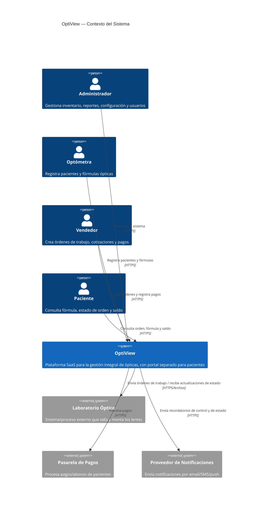
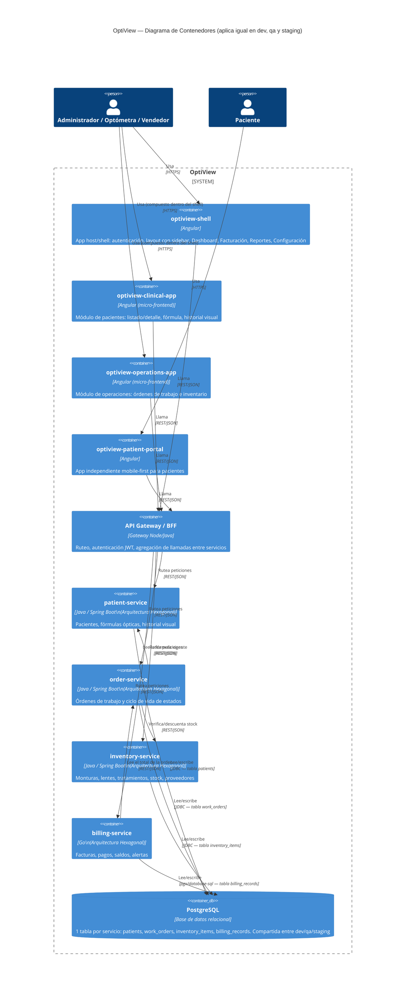
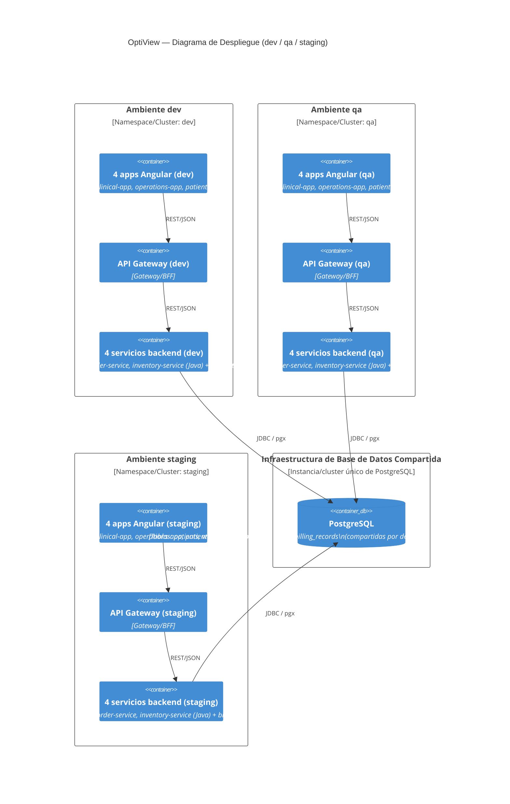

# OptiView — Modelado de Arquitectura C4

---

## Nivel 1 — Diagrama de Contexto del Sistema

Muestra a OptiView como un único sistema y sus interacciones con usuarios y sistemas externos.

---

## Nivel 2 — Diagrama de Contenedores

Muestra las unidades desplegables principales: 4 frontends Angular, un API Gateway/BFF, 4 servicios backend (3 Java + 1 Go) y la base de datos PostgreSQL compartida.

**Notas:**
- `optiview-shell`, `optiview-clinical-app` y `optiview-operations-app` se componen como micro-frontends dentro de una única experiencia autenticada (ej. vía Module Federation), en línea con la navegación de sidebar descrita en el PRD (sección 5.1).
- `optiview-patient-portal` se despliega y versiona de forma independiente, mobile-first, sin sidebar (PRD sección 5.2).
- Las llamadas entre servicios (`order-service → inventory-service`, `order-service → patient-service`, `billing-service → order-service`) ocurren vía REST, nunca por acceso directo a base de datos — cada servicio es propietario exclusivo de su tabla.

---

## Nivel 3 — Diagrama de Componentes (ejemplo: `order-service`)

Hace zoom sobre `order-service` para mostrar su **arquitectura hexagonal** interna. El mismo patrón (núcleo de dominio, puertos de entrada/salida, adaptadores de entrada/salida) aplica a `patient-service` e `inventory-service` (Java) y, de forma idiomática, a `billing-service` (Go).

```mermaid
C4Component
 title order-service — Diagrama de Componentes (Arquitectura Hexagonal)

 Container_Boundary(orderSvc, "order-service (Java / Spring Boot)") {

 Component(restController, "WorkOrderRestController", "Adaptador de Entrada (REST)", "Expone los endpoints /api/v1/work-orders")

 Component(createUseCase, "CreateWorkOrderUseCase", "Puerto de Entrada / Servicio de Aplicación", "Orquesta la creación de una nueva orden de trabajo")
 Component(advanceUseCase, "AdvanceWorkOrderStatusUseCase", "Puerto de Entrada / Servicio de Aplicación", "Avanza la orden al siguiente estado del ciclo de vida")
 Component(queryUseCase, "QueryWorkOrdersUseCase", "Puerto de Entrada / Servicio de Aplicación", "Lista y consulta órdenes de trabajo")

 Component(domain, "Modelo de Dominio WorkOrder", "Núcleo de Dominio", "Entidades/value objects WorkOrder, OrderLineItem, OrderStatus y reglas de negocio")

 Component(repoPort, "WorkOrderRepositoryPort", "Puerto de Salida", "Interfaz para persistir/recuperar órdenes de trabajo")
 Component(inventoryPort, "InventoryClientPort", "Puerto de Salida", "Interfaz para verificar/descontar stock")
 Component(patientPort, "PatientClientPort", "Puerto de Salida", "Interfaz para leer la fórmula vigente del paciente")
 Component(notificationPort, "NotificationPort", "Puerto de Salida", "Interfaz para notificar al paciente ante cambio de estado")

 Component(repoAdapter, "PostgresWorkOrderRepository", "Adaptador de Salida", "Implementa WorkOrderRepositoryPort contra la tabla work_orders")
 Component(inventoryAdapter, "InventoryServiceHttpClient", "Adaptador de Salida", "Implementa InventoryClientPort mediante llamadas REST a inventory-service")
 Component(patientAdapter, "PatientServiceHttpClient", "Adaptador de Salida", "Implementa PatientClientPort mediante llamadas REST a patient-service")
 Component(notificationAdapter, "NotificationHttpClient", "Adaptador de Salida", "Implementa NotificationPort vía el proveedor de notificaciones")
 }

 ContainerDb(db, "PostgreSQL", "tabla: work_orders")
 Container(inventorySvc, "inventory-service", "Java / Spring Boot")
 Container(patientSvc, "patient-service", "Java / Spring Boot")
 System_Ext(notification, "Proveedor de Notificaciones")

 Rel(restController, createUseCase, "Invoca")
 Rel(restController, advanceUseCase, "Invoca")
 Rel(restController, queryUseCase, "Invoca")

 Rel(createUseCase, domain, "Usa")
 Rel(advanceUseCase, domain, "Usa")
 Rel(queryUseCase, domain, "Usa")

 Rel(createUseCase, repoPort, "Usa")
 Rel(createUseCase, inventoryPort, "Usa")
 Rel(createUseCase, patientPort, "Usa")
 Rel(advanceUseCase, repoPort, "Usa")
 Rel(advanceUseCase, notificationPort, "Usa")
 Rel(queryUseCase, repoPort, "Usa")

 Rel(repoAdapter, repoPort, "Implementa")
 Rel(inventoryAdapter, inventoryPort, "Implementa")
 Rel(patientAdapter, patientPort, "Implementa")
 Rel(notificationAdapter, notificationPort, "Implementa")

 Rel(repoAdapter, db, "Lee/escribe", "JDBC")
 Rel(inventoryAdapter, inventorySvc, "Llama", "REST/JSON")
 Rel(patientAdapter, patientSvc, "Llama", "REST/JSON")
 Rel(notificationAdapter, notification, "Llama", "HTTPS")
```

**Cómo leer el hexágono:**
- El **núcleo de dominio** (`Modelo de Dominio WorkOrder`) no tiene dependencias hacia Spring, HTTP o JDBC — es lógica de negocio pura.
-**Lado de entrada** (izquierda): controlador REST → casos de uso (puertos de entrada) → dominio.
-**Lado de salida** (derecha): los casos de uso dependen de **interfaces de puertos de salida** (`WorkOrderRepositoryPort`, `InventoryClientPort`, etc.), nunca de adaptadores concretos. Los adaptadores concretos (Postgres/REST) se inyectan en tiempo de ejecución (inversión de dependencias).
- Por esto la tecnología de base de datos, el transporte hacia inventory-service, o el proveedor de notificaciones pueden cambiar sin tocar `CreateWorkOrderUseCase` ni el modelo de dominio.

---

## Nivel 4 — Diagrama de Despliegue (Ambientes)

Muestra cómo los 4 servicios backend + 4 frontends se replican en los tres ambientes, y cómo todos comparten la misma base de datos PostgreSQL.

**Datos clave del despliegue:**
- Cada ambiente (`dev`, `qa`, `staging`) tiene su **propio despliegue independiente** de los 4 servicios backend y los 4 frontends Angular — versiones independientes, configuración independiente, logs independientes.
- Los tres ambientes apuntan a la **misma base de datos PostgreSQL y a las mismas 4 tablas** (`patients`, `work_orders`, `inventory_items`, `billing_records`). No hay esquema-por-ambiente ni base de datos-por-ambiente.
- Implicación práctica: una prueba destructiva en `dev` (ej. eliminar un paciente o una orden) es visible de inmediato desde `qa` y `staging`, ya que todos consultan las mismas filas. Cualquier estrategia de datos de prueba (seeding, limpieza) debe tener en cuenta este estado compartido.

---

## Anexo — Matriz de propiedad de tablas

| Tabla | Servicio propietario | ¿Leída/escrita por otros servicios? |
|---|---|---|
| `patients` | patient-service | No — se accede solo vía la API REST de patient-service |
| `work_orders` | order-service | No — se accede solo vía la API REST de order-service |
| `inventory_items` | inventory-service | No — se accede solo vía la API REST de inventory-service |
| `billing_records` | billing-service | No — se accede solo vía la API REST de billing-service |

Aunque todas las tablas residen en la misma base de datos PostgreSQL y se comparten entre ambientes, **ningún servicio lee o escribe directamente la tabla de otro servicio** — las necesidades de datos entre servicios siempre se resuelven mediante llamadas REST al servicio propietario, preservando los límites de contexto delimitado (bounded context) que exige la arquitectura hexagonal.
