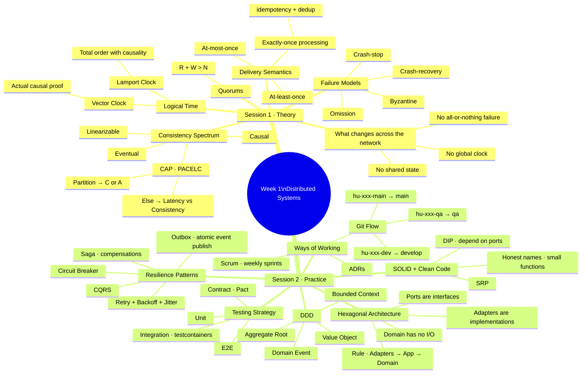

```mermaid
mindmap
  root((Week 1\nDistributed Systems))
    Session 1 · Theory
      What changes across the network
        No shared state
        No global clock
        No all-or-nothing failure
      Failure Models
        Crash-stop
        Crash-recovery
        Omission
        Byzantine
      Logical Time
        Lamport Clock
          Total order with causality
        Vector Clock
          Actual causal proof
      Consistency Spectrum
        Linearizable
        Causal
        Eventual
        CAP · PACELC
          Partition → C or A
          Else → Latency vs Consistency
      Delivery Semantics
        At-most-once
        At-least-once
        Exactly-once processing
          idempotency + dedup
      Quorums
        R + W > N
    Session 2 · Practice
      DDD
        Bounded Context
        Aggregate Root
        Value Object
        Domain Event
      Hexagonal Architecture
        Domain has no I/O
        Ports are interfaces
        Adapters are implementations
        Rule · Adapters → App → Domain
      SOLID + Clean Code
        SRP
        DIP · depend on ports
        Honest names · small functions
      Resilience Patterns
        Circuit Breaker
        Retry + Backoff + Jitter
        Saga · compensations
        Outbox · atomic event publish
        CQRS
      Testing Strategy
        Unit
        Integration · testcontainers
        Contract · Pact
        E2E
      Ways of Working
        Scrum · weekly sprints
        Git Flow
          hu-xxx-dev → develop
          hu-xxx-qa → qa
          hu-xxx-main → main
        ADRs
```
